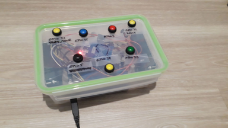

# The jbert Project
## Idea
The Hörbert (https://www.hoerbert.com) is cool but too 
expensive and not flexible enough.

The Toniebox (https://tonies.de) is cool, but the tonies are too expensive.


## Prototype Hardware #1
Audio player with 9 buttons and a RFID reader to control the audio playback.



### Hardware Components
 * Raspberry Pi Zero W (AliExpress)
 * Waveshare WM8960 Hi-Fi Sound Card HAT for Raspberry Pi, with speakers (AliExpress)
 * MFRC522 RFID Reader (AliExpress)
 * RFID chips (AliExpress)
 * Buttons (AliExpress)
 * USB-B jack (AliExpress)
 * Jumper calbes (AliExpress)
 * Samsung Evo+ microSD UHS-I (32GB, Class 10) (https://www.digitec.ch)
 * Micro USB calbes (private stock)
 * Powerbank (present from Spital Uster (https://www.spitaluster.ch))
 * Housing, rotho tupperware (Migros)


## Software
 * Raspbian Lite: https://www.raspberrypi.org/downloads/raspbian/
 * WM8960 driver: https://github.com/waveshare/WM8960-Audio-HAT
 * MPD: https://www.musicpd.org/
 * Pi4J: https://pi4j.com/1.2/index.html
 * JavaMPD: https://github.com/finnyb/javampd

The list is not complete.


## jbert Application Release Notes
### 0.2.0
 * Audio playback control using hardware buttons
   * Volume up / down
   * Pause / Play
   * Next track
   * Playlist selection (5)
 * Playlist selection using RFID chips

### 0.1.0
 * Audio playback control using hardware buttons
   * Volume up / down
   * Pause / Play
   * Next / previous track
 * Playlist selection using RFID chips


## Todo
 * Web frontend to manage the jbert
   * Audio upload
   * Playlist management
   * Configuration management
 * Manage WLAN from the application
   * AP / Client
 * Read-only rootfs
 * Decrease system start time
 * Prototype #2
   * Using a UE boom for audio playback


## How-To
### Install Raspbian
 * Copy the Raspbian system to the microSD card (Tested with 2019-07-10-raspbian-buster-lite.zip)
   * Place an empty file named 'ssh' onto the boot (FAT) partition (https://hackernoon.com/raspberry-pi-headless-install-462ccabd75d0)
   * Place a file named 'wpa_supplicant.conf' with this content onto the boot partition:
    ```text
    country=EU
    ctrl_interface=DIR=/var/run/wpa_supplicant GROUP=netdev
    update_config=1

    network={
        ssid="NETWORK-NAME"
        psk="NETWORK-PASSWORD"
    }
    ```

### Bootstrap jbert
To install all needed software packages / drivers:
```
sam@guido:~/projects/git/jbert$ ssh-copy-id pi@$JBERT_IP
sam@guido:~/projects/git/jbert$ ./bootstrap.sh $JBERT_IP
```

### Deploy jbert Application
Debian package build (sbt-native-packager) and deploy is documented in this two scripts:
```
sam@guido:~/projects/git/jbert$ ssh-copy-id pi@$JBERT_IP
sam@guido:~/projects/git/jbert$ ./cleanBuild.sh && ./deploy.sh $JBERT_IP ./application/target/application_0.1.0-SNAPSHOT_all.deb
```

### Manage MPD Audio / Playlists
Connect using a MPD client (http://ario-player.sourceforge.net).
Or copy audio files and playlists using scp or rsync.
```text
sam@guido:~/projects/git/jbert$ rsync --chmod=664 --chown=mpd:audio -avh music playlists pi@$JBERT_IP:/var/lib/mpd/
```

### Monitor Target JVM
Due to the fact that the Raspberry Pi Zero hardware is not the most powerful one it might be good to understand
what is going on on the target JVM.
 * JMX enabled in the javaOptions defined in `build.sbt`
 * SOCKS tunnel to the target opened:
```
sam@guido:~$ ssh -v -D 9696 pi@$JBERT_IP
```
 * VisualVM configured to use the SOCKS proxy
 * Connection to the target port opened (build.sbt, jmxremote.port)

Source: https://dzone.com/articles/visualvm-monitoring-remote-jvm
